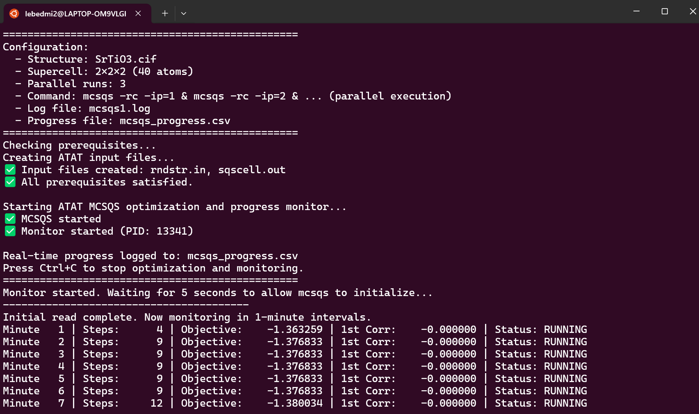
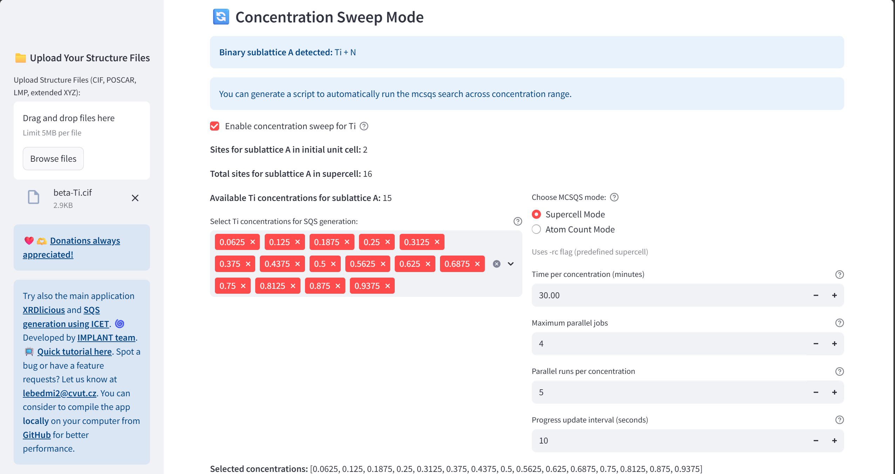
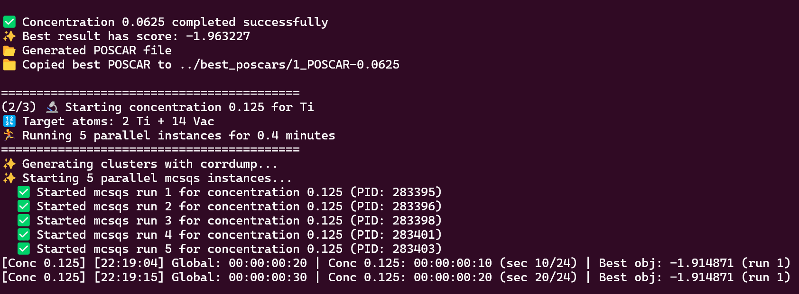

# SimplySQS: Interactive interface for ATAT mcsqs input files generation and output analysis 
 Online application for generating and analyzing (SQS) (Special Quasi-Random Structures) using the ATAT mcsqs (Alloy Theoretic Automated Toolkit).  
 **Access the application online here: [ATAT SQS GUI](https://atat-sqs.streamlit.app)**  
 **Video tutorial at: [YouTube](https://youtu.be/GGo_9T5wqus?si=d3ATtFdfy1NYUCO8)**  
 **Video tutorial for running ATAT mcsqs search across concentration range of binary alloys at: [YouTube](https://youtu.be/wL5re3Fu1nQ?si=anuqQD88x4xLYmec)**  
 
 

 
# **How to compile and run the ATAT SQS GUI locally:** 

### **Prerequisities**: 
- Python 3.11 (Tested 3.12)
- Console (For Windows, I recommend to use WSL2 (Windows Subsystem for Linux))
- Git (optional for downloading the code)
  

### **Compile the app**  
Open your terminal console and write the following commands (the **bold text**):  
(Optional) Install Git:  
      **sudo apt update**  
      **sudo apt install git**    

1) Download updates and prerequisites:  
   **sudo apt update**  
   **sudo apt install -y python3-venv**  
   Download the SimplySQS code from GitHub (or download it manually without Git on the following link by clicking on 'Code' and 'Download ZIP', then extract the ZIP. With Git, it is automatically extracted):  
      **git clone https://github.com/bracerino/atat-sqs-gui.git**

3) Navigate to the downloaded project folder:  
      **cd atat-sqs-gui/**

4) Create a Python virtual environment to prevent possible conflicts between packages:  
      **python3 -m venv atat-sqs_env**

5) Activate the Python virtual environment (before activating, make sure you are inside the xrdlicious folder):  
      **source atat-sqs_env/bin/activate**
   
6) Install all the necessary Python packages:  
      **pip install -r requirements.txt**

7) Run the ATAT SQS GUI app (always before running it, make sure to activate its Python virtual environment (Step 4):  
      **streamlit run app.py**

### Tested Python packages  
Python 3.12.3  
- streamlit==1.45.1  
- pandas==2.3.0  
- numpy==2.2.6  
- pymatgen==2025.5.28  
- ase==3.25.0  
- matminer==0.9.3  
- plotly==6.1.2  
- matplotlib==3.10.3  
- mp-api==0.45.3  
- aflow==0.0.11  
- py3Dmol==2.4.2  

 ## Workflow overview
 - Upload crystal structures or retrieved them from implemented search interface in MP, AFLOW, and COD databases.
 - Generate ATAT Input Files: Create rndstr.in and sqscell.out files with global or sublattice-specific composition control. The concentrations are automatically recalculated for the achiavable concentrations given the total number of atoms in supercell.
 - Generate complete bash script that will create the rndstr.in and sqscell.out and run the ATAT mcsqs with improved monitoring and creating the mcsqs_progress.csv
 - Generate complete bash script to automate the SQS search across a range of compositions for a binary alloy system.
 - Convert ATAT Output: Transform bestsqs.out files to VASP, CIF, LAMMPS, and XYZ formats with 3D visualization
 - Monitor Optimization: Analyze ATAT convergence from log files (mcsqs.log or at once for parallel run with mcsqs1.log, mcsqs2.log, ...) and CSV time progress file (mcsqs_progress.csv) data with interactive plots and main information. For parallel run, it will automatically identify the best performing optimization
 - Calculate PRDF: Compute Partial Radial Distribution Functions for SQS
 - Create Vacancy Structures: Generate ordered defects by selectively removing specific element from the SQS

## Workflow steps
- Upload crystal structure file (POSCAR, LMP, CIF, XYZ (with lattice)) and select composition mode (whether to change concentration for all atomic site, or for sublattices (based on wyckoff symbol))

---

- Set supercell size (this also determine the number of atoms for option when not fixing the supercell shape)

---

- Set elements and concentrations for atomic sites. The achiavable concentrations are automatically recalculated based on the set supercell (number of atoms)

---

- Generate ATAT input files (rndstr.in, sqscell.out)

---

- See the commands to use in the console for running this settings in ATAT mcsqs

---

- Download bash script file that will automatically create the set rndstr.in and sqscell.out, and run the ATAT mcsqs with the given settings from this interface. Additionally, it will create a new file with improved time dependent convergence, and shows updated information in the console every 1 minute 

---

---

- Create bash script that will automatically run the mcsqs search across concentration range for the selected two elements on a sublattice or in a global concentration mode

---

---

- Upload the found SQS (bestsqs.out) and convert it to POSCAR, LMP, CIF, or XYZ format

---

---

- Calculate PRDF for the found SQS (bestsqs.out)

---

- Remove certain atomic element to create ordered vacancies if needed

---

- Upload log file (mcsqs.log) and see the values of objective functions

---

- Upload mcsqs_progress.csv (if the ATAT mcsqs was run with the provided bash script) and see the convergence of objective function over time

---

- Upload multiple log files from the parallel run (mcsqs1.log, mcsqs2.log, ...) and see the values of objective functions and the best and wort found SQS

---

